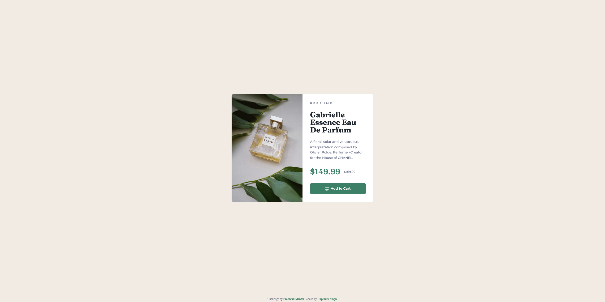

# Frontend Mentor - Product preview card component solution

This is a solution to the [Product preview card component challenge on Frontend Mentor](https://www.frontendmentor.io/challenges/product-preview-card-component-GO7UmttRfa). Frontend Mentor challenges help you improve your coding skills by building realistic projects. 

## Table of contents

- [Frontend Mentor - Product preview card component solution](#frontend-mentor---product-preview-card-component-solution)
  - [Table of contents](#table-of-contents)
  - [Overview](#overview)
    - [The challenge](#the-challenge)
    - [Screenshot](#screenshot)
    - [Links](#links)
  - [My process](#my-process)
    - [Built with](#built-with)
    - [What I learned](#what-i-learned)
    - [Useful resources](#useful-resources)
  - [Author](#author)

## Overview

### The challenge

Users should be able to:

- View the optimal layout depending on their device's screen size
- See hover and focus states for interactive elements

### Screenshot

,

### Links

<!-- - Solution URL: [Frontend Mentor](https://your-solution-url.com) -->
- Live Site URL: [GitHub pages](https://pellia.github.io/fm-product-preview-card/)

## My process

### Built with

- Semantic HTML
- CSS | Grid | Flex | Custom Properties | Media Queries
- Responsive Design


### What I learned

I used ```rem``` units instead of pixels for font sizes and spacing to ensure better scalability and responsiveness.

```css
:root {
  /* Typography */
  --text-preset-1: 700 2rem / 100% var(--font-fraunces);
  --text-preset-2: 700 0.875rem / 110% var(--font-montserrat);
  --text-preset-3: 500 0.875rem / 160% var(--font-montserrat);
  --text-preset-4: 500 0.75rem / 120% var(--font-montserrat);
  --text-preset-5: 500 0.8125rem / 120% var(--font-montserrat);

  /* Spacing */
  --space-50: 0.25rem;
  --space-100: 0.5rem;
  --space-200: 1rem;
  --space-300: 1.5rem;
  --space-400: 2rem;
  --space-500: 2.5rem;
}
```

### Useful resources

- [Replace an image with CSS 1](https://css-tricks.com/replace-the-image-in-an-img-with-css/) - Replace the Image in an `````` with CSS using ```background-image```
- [Replace an image with CSS 2](https://www.reddit.com/r/css/comments/7ipjp1/how_to_replace_an_image_with_another_with_css_only/) - Another way to replace an image with css through replaceing the src content.
- [CSS em and rem explained](https://www.youtube.com/watch?v=_-aDOAMmDHI) - How em and rem units work and when to use them.

## Author

- Website - [Rupinder Singh](https://www.rupinder-singh.com/)
- Frontend Mentor - [@Pellia](https://www.frontendmentor.io/profile/Pellia)
